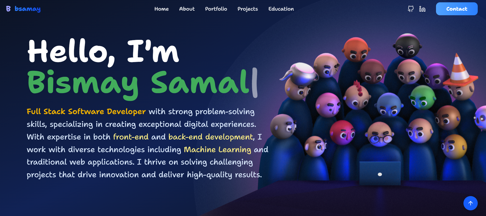

# Portfolio Website

A modern, interactive portfolio website built with React and enhanced with 3D elements using Spline.



## 🚀 Tech Stack

### Core
- **React 19.1.0** - A JavaScript library for building user interfaces
- **Vite 7.0.0** - Next generation frontend tooling for blazing fast development

### Styling & UI
- **Tailwind CSS 4.1.11** - Utility-first CSS framework
- **Framer Motion 12.23.0** - Production-ready motion library for React
- **Lucide React 0.525.0** - Beautiful & consistent icon toolkit
- **React Icons 5.5.0** - Popular icon library

### 3D & Interactive Elements
- **Spline React 4.0.0** - React integration for Spline 3D designs

### Routing
- **React Router DOM 7.11.0** - Declarative routing for React applications

```

## 🛠️ Installation

1. Clone the repository:
```bash
git clone <your-repository-url>
cd portfolio-one
```

2. Install dependencies:
```bash
npm install
```

## 🏃 Running the Application

### Development Mode
Start the development server with hot reload:
```bash
npm run dev
```
The application will be available at `http://localhost:5173`

### Build for Production
Create an optimized production build:
```bash
npm run build
```

### Preview Production Build
Preview the production build locally:
```bash
npm run preview
```

### Lint Code
Run ESLint to check code quality:
```bash
npm run lint
```

## 📁 Project Structure

```
portfolio-one/
├── public/          # Static assets
├── src/             # Source files
│   ├── components/  # React components
│   ├── pages/       # Page components
│   └── ...
├── package.json     # Project dependencies
└── vite.config.js   # Vite configuration
```

## ✨ Features

- ⚡ Lightning-fast performance with Vite
- 🎨 Modern UI with Tailwind CSS
- 🎭 Smooth animations with Framer Motion
- 🌐 3D interactive elements with Spline
- 📱 Fully responsive design
- 🧭 Client-side routing with React Router


## 📄 License

This project is private and not licensed for public use.
